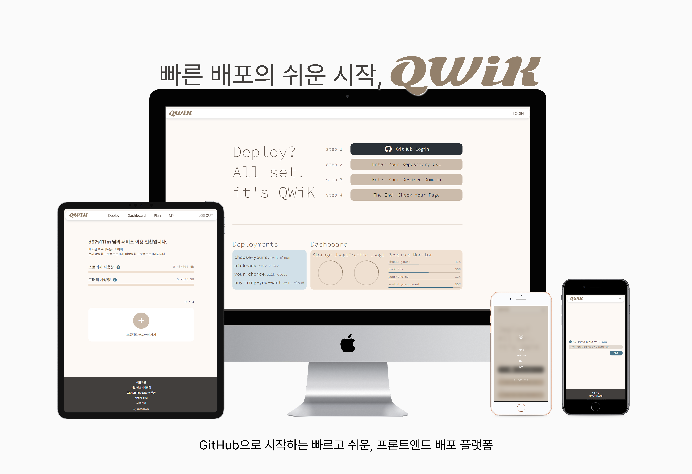
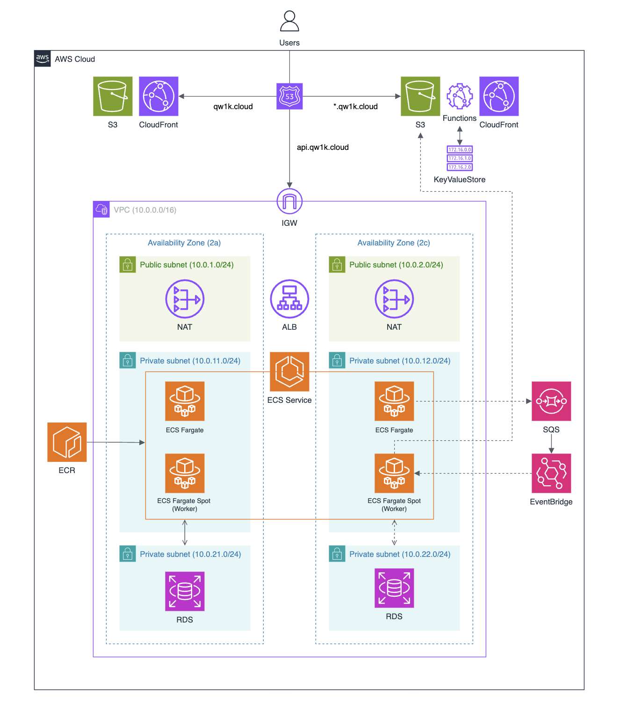
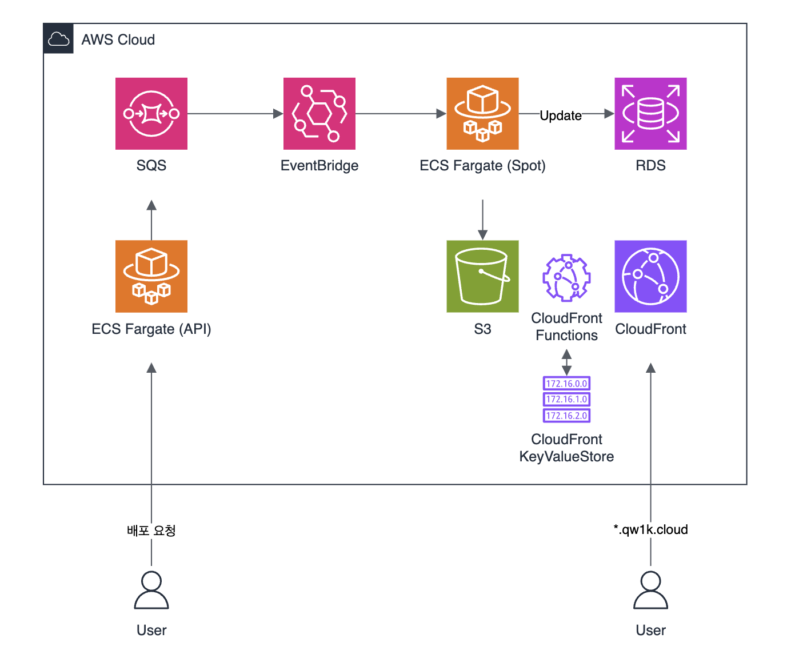
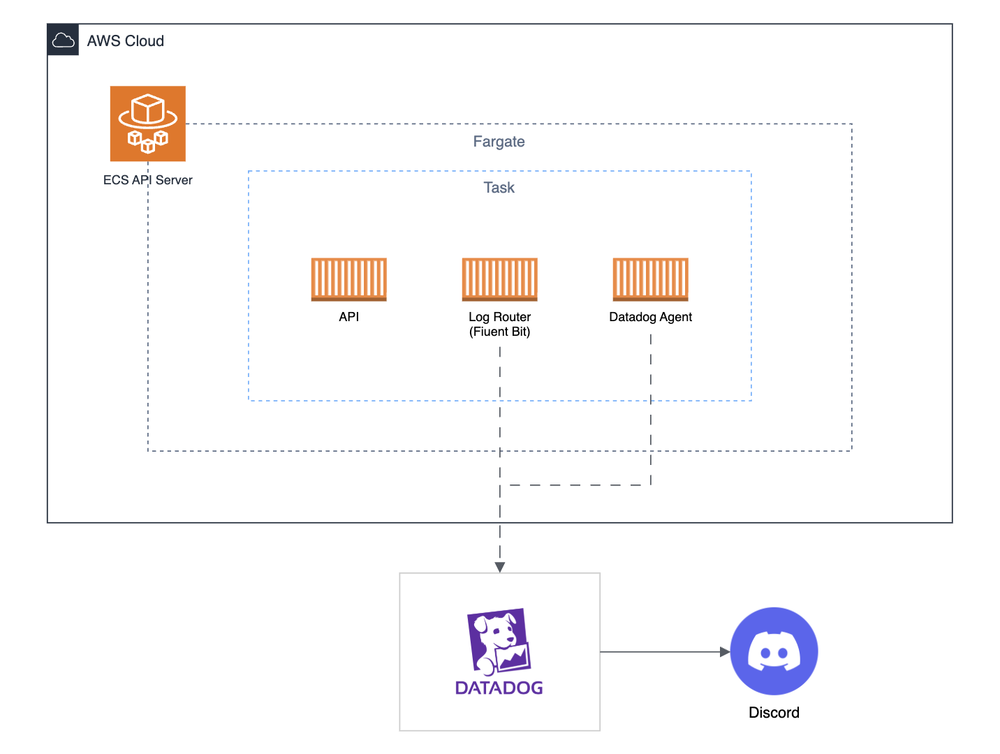

# QWiK - 정적 웹사이트 배포 플랫폼

QWiK은 개발자가 복잡한 인프라 설정 없이 정적 사이트를 빠르게 배포할 수 있도록 지원합니다.

GitHub 저장소를 입력하면 자동으로 빌드 및 배포되며, 자신의 프로젝트에 `*.qw1k.cloud` 서브도메인이 할당됩니다.

서비스 사용해보기: https://qw1k.cloud (중단)

## 📋 기본 정보

| 항목 | 내용                              |
| ---- | --------------------------------- |
| 팀명 | QWiK                              |
| 기간 | 2025.11 ~ 2026.02.03              |
| 과정 | 구름 클라우드 네이티브 엔지니어링 |
| 목표 | 링크만으로 정적 웹사이트 배포     |

## 👥 팀 구성

| 이름   | 역할     |
| ------ | -------- |
| 남태욱 | BE/Infra |
| 김승현 | BE/Infra |
| 안다솜 | FE       |

## ⚙️ 기술 스택

<table>
  <thead>
    <tr>
      <th>분류</th>
      <th>기술 스택</th>
    </tr>
  </thead>
  <tbody>
    <tr>
      <td><b>Frontend</b></td>
      <td>
        
      </td>
    </tr>
    <tr>
      <td><b>Backend</b></td>
      <td>
        
        
        
      </td>
    </tr>
    <tr>
      <td><b>Infrastructure</b></td>
      <td>
        
         
        
        
        
        
         
        
        
        
         
        
        
      </td>
    </tr>
    <tr>
      <td><b>CI/CD</b></td>
      <td>
        
      </td>
    </tr>
  </tbody>
</table>

## 🏗️ 인프라 아키텍처

- ✅ Terraform으로 전체 인프라 프로비저닝
- ✅ ECS Fargate 기반 컨테이너 운영 (API, Worker)
- ✅ CloudFront + S3 정적 리소스 배포
- ✅ ALB + Route 53을 통한 트래픽 라우팅
- ✅ GitHub Actions OIDC 인증 기반 CI/CD 파이프라인
- ✅ Datadog 기반 모니터링

## 🚀 배포 파이프라인

- ✅ GitHub 저장소 URL 입력 → 자동 빌드/배포
- ✅ SQS → EventBridge Pipes → ECS RunTask 이벤트 드리븐 구조
- ✅ Worker가 빌드 완료 후 S3 업로드
- ✅ CloudFront Functions + KVS로 `*.qw1k.cloud` 동적 서브도메인 라우팅

## 📊 모니터링

- ✅ ECS Task 사이드카 패턴 (API + Fluent Bit + Datadog Agent)
- ✅ Datadog 기반 로그 수집 및 메트릭 모니터링
- ✅ Discord 알림 연동

